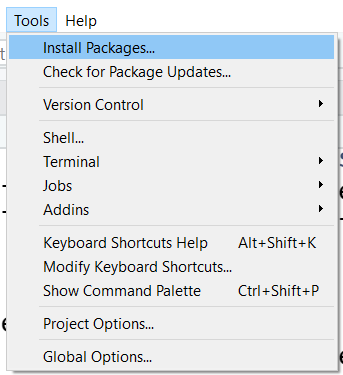
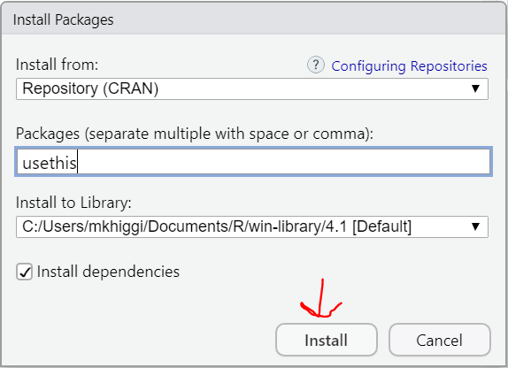
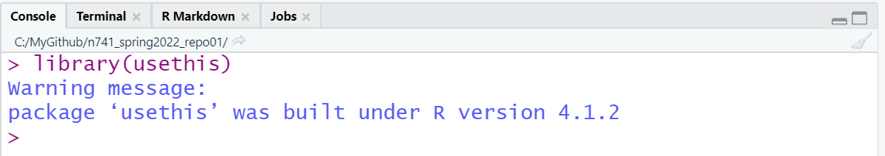

```{r setup, include=FALSE}
knitr::opts_chunk$set(echo = FALSE)
knitr::opts_chunk$set(warning = FALSE)
knitr::opts_chunk$set(message = FALSE)
knitr::opts_chunk$set(error = TRUE)
```

## What is a PAT and why do I need one?

At this point in your overall life and as a college student, you have probably encountered various times when you need to provide some additional "authorization" besides your email to get logged into an account or website. This is known as 2FA (2-factor authentication).

For Github, to use HTTPS (secure hypertext transfer protocol) (which is what we recommend for sync'ing your RStudio projects to Github repositories), you know need additional authentication. We will provide this authentication through a "personal access token" or PAT.

Learn more at

-   [Github Docs](https://docs.github.com/en/authentication/keeping-your-account-and-data-secure/creating-a-personal-access-token)
-   [Ch9 - Happy Git and Github for the UseR by Jenny Bryan](https://happygitwithr.com/https-pat.html).

## STEP 1: Open RStudio, Install `usethis` package

To get started, first install the `usethis` package. To add additional functionality to R, you will need to install "packages" which mostly provide a collection of functions you can use after you

1.  install the package and
2.  then "attach" that package to your R session.

Open RStudio, go to "Tools", "Install Packages" and type in "usethis", click install. Watch your "Console" window (lower left panel) to check for any errors and a message stating that your package was downloaded to your computer.





The best way to double check that the package was correctly installed is to click on the "Packages" TAB (lower right panel) and see if "usethis" is in your package list.


## STEP 2: Attach usethis package to your R Session

Go to your "Console" window (lower left panel) and attach the `usethis` package using the `library()` function.



## STEP 3: Create your PAT and Store It

These next two steps are explained in Jenny Bryan's "Happy Git and Github for the UseR" online book [Ch9 - Happy Git and Github for the UseR by Jenny Bryan](https://happygitwithr.com/https-pat.html).

### Generate your PAT

In the "Console" window, type the following:

`usethis::create_github_token()`

This will open your browser and take you to Github. Be sure to log into your Github account if you aren't already.

Type in a description for your PAT (why do you want one) and choose an expiration date. It is ok to choose unlimited but you will get a warning. Keep the default settings. Scroll to the bottom and click "Generate".


This will take you to your PATs page for your Github account. Be sure to click the "copy to clipboard" button to copy your PAT to yoru clipboard.

I personnaly then paste this into a text editor like notepad to save it on my computer. But keep it in the clipboard for a moment - because you will paste it in the next step.

Go back to your RStudio Console and type the following:


## STEP 4: Try a push to Github

Now go back to your RStudio project, make a change to your project folder. For example, make a few simple edits to your "README.md" file, "stage", "commit" and then "push" your changes to Github and check that you are NOT asked to type in your password again.


