```{r setup, include=FALSE}
knitr::opts_chunk$set(echo = FALSE)
knitr::opts_chunk$set(warning = FALSE)
knitr::opts_chunk$set(message = FALSE)
knitr::opts_chunk$set(error = TRUE)
```

# What is a PAT and why do I need one?

At this point in your overall life and as a college student, you have probably encountered various times when you need to provide some additional "authorization" besides your email or username and a password to get logged into an account or website. This is known as 2FA (2-factor authentication).

For Github, to use HTTPS (secure hypertext transfer protocol) (which is what we recommend for sync'ing your RStudio projects to Github repositories), you now need additional authentication. You will need to provide this authentication through a "personal access token" or PAT.

Learn more at

-   [Github Docs](https://docs.github.com/en/authentication/keeping-your-account-and-data-secure/creating-a-personal-access-token)
-   [Ch9 - Happy Git and Github for the UseR by Jenny Bryan](https://happygitwithr.com/https-pat.html).

# STEP 1: Open RStudio, Install `usethis` package

To get started, first install the `usethis` package. To add additional functionality to R, you will need to install "packages" which mostly provide a collection of functions you can use after you do the following:

1.  install the package and
2.  then "attach" that package to your R session.

Open RStudio, go to "Tools", "Install Packages" and type in "usethis", click install. Watch your "Console" window (RStudio lower left panel) to check for any errors and a message stating that your package was downloaded to your computer.

```{r, echo=FALSE, out.width="50%"}
knitr::include_graphics("tools_install.png")
```

```{r, echo=FALSE, out.width="50%"}

```

The best way to double check that the package was correctly installed is to click on the "Packages" TAB (RStudio lower right panel) and see if "usethis" is in your package list.

```{r, echo=FALSE, out.width="80%"}
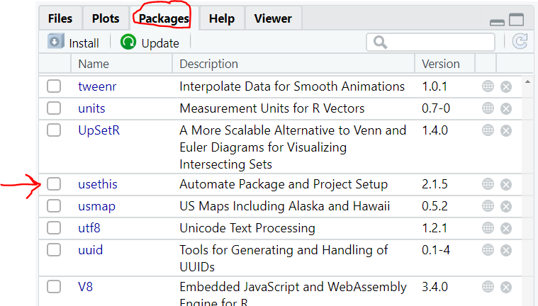
```

# STEP 2: Attach `usethis` package to your R Session

Go to your "Console" window (RStudio lower left panel) and attach the `usethis` package using the `library()` function.

Type `library(usethis)` at the `>` prompt.

```{r, echo=FALSE, out.width="80%"}

```

# STEP 3: Create your PAT and Store It

These next two steps are explained in Jenny Bryan's "Happy Git and Github for the UseR" online book [Ch9 - Happy Git and Github for the UseR by Jenny Bryan](https://happygitwithr.com/https-pat.html).

## Generate your PAT

In the "Console" window, type the following:

`usethis::create_github_token()`

```{r, echo=FALSE, out.width="80%"}
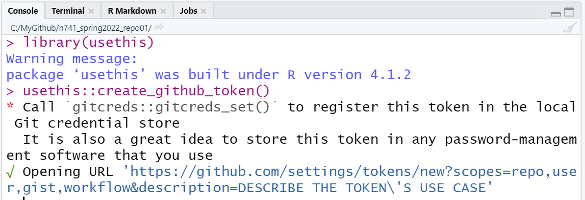
```

This will open your browser and take you to Github. Log into your Github account.

```{r, echo=FALSE, out.width="50%"}
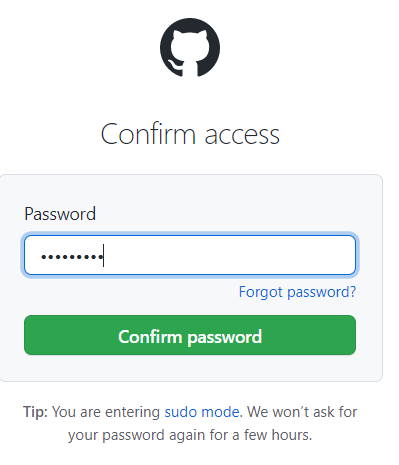
```

Type in a description for your PAT (why do you want one) and choose an expiration date. It is ok to choose unlimited but you will get a warning. Keep the default settings. Scroll to the bottom and click "Generate".

```{r, echo=FALSE, out.width="100%"}
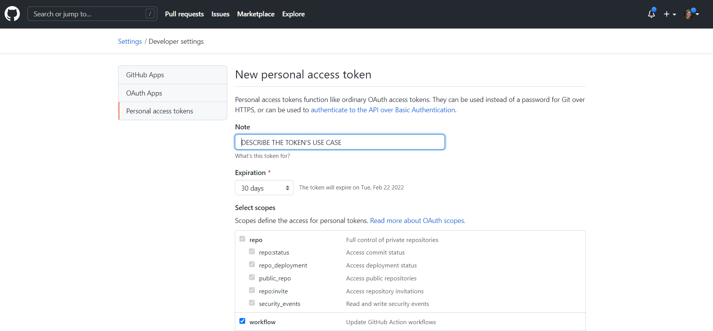
```

```{r, echo=FALSE, out.width="100%"}
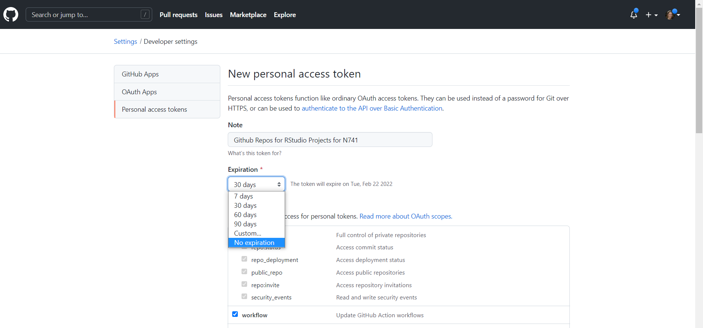
```

```{r, echo=FALSE, out.width="100%"}
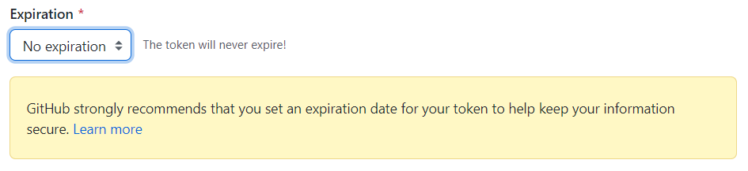
```

```{r, echo=FALSE, out.width="80%"}
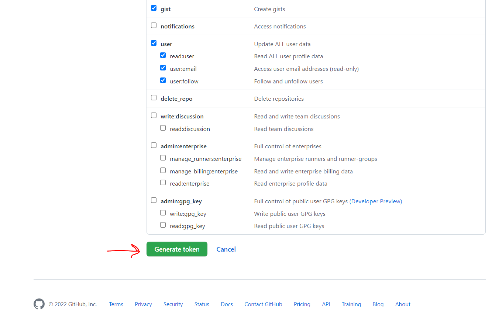
```

This will take you to your PATs page for your Github account. Be sure to click the "copy to clipboard" button to copy your PAT to your clipboard.

```{r, echo=FALSE, out.width="80%"}
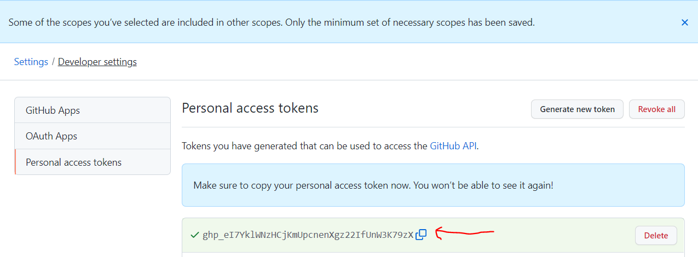
```

I personally then paste this into a text editor like notepad to save it on my computer. But keep it in the clipboard for a moment - because you will paste it in the next step.

Go back to your RStudio Console and type the following:

`gitcreds::gitcreds_set()`

And NOW "PASTE" (control-V or command-V) your PAT here after the `? Enter password or token: ` and click return.

```{r, echo=FALSE, out.width="80%"}
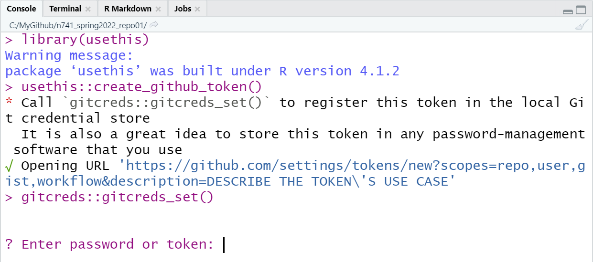
```

You should see the following in your Console:

```{r, echo=FALSE, out.width="50%"}
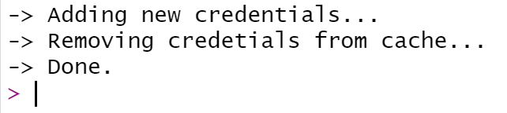
```

That's it - your PAT should now be saved and ready to use.

# STEP 4: Try a push to Github

Now go back to your RStudio project, make a change to your project folder. For example, make a few simple edits to your "README.md" file, "stage", "commit" and then "push" your changes to Github and check that you are NOT asked to type in your password again.

## Stage a file that has been changed

Go to the RStudio top right panel and go to the "Git" TAB.

Notice the "M" next to the README.md file - this indicates that this file has been "modified." Click the checkbox next to this file to "Stage" (or add) to your list of files to be committed.

NEXT - Click the "Commit" button.

```{r, echo=FALSE, out.width="80%"}
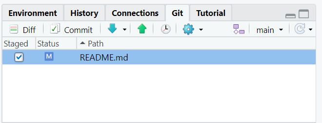
```

## Commit this change

After you click the "Commit" button, this window will open.

Type in a message for what changes this commit includes - describe what changes you are making to your repository.

Then click "Commit".

```{r, echo=FALSE, out.width="80%"}
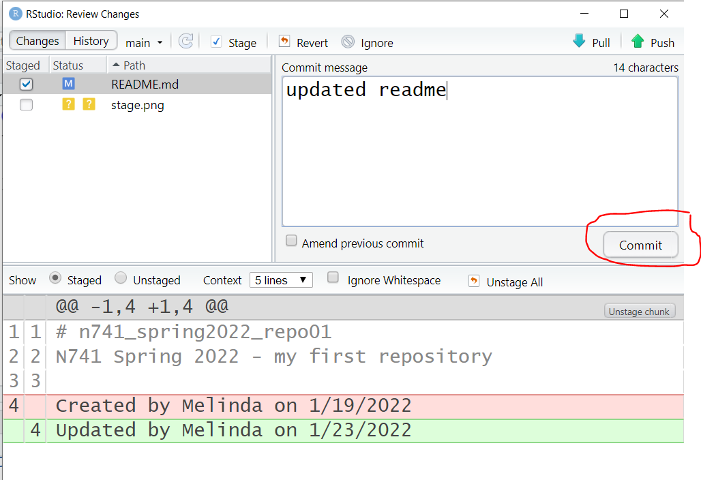
```

After clicking "Commit" another message window will open to show you the result of this command. Check that there are no errors.

```{r, echo=FALSE, out.width="80%"}
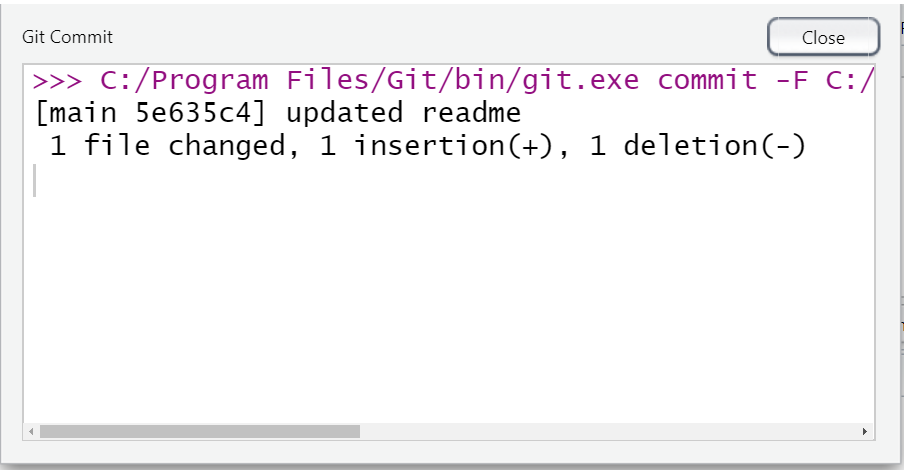
```

## Push these changes back up to your Github repo

Even though the file looks like the changes have been accepted, you are NOT DONE YET. You MUST click "PUSH" to send the changes back UP to Github from your local computer.

```{r, echo=FALSE, out.width="80%"}
knitr::include_graphics("push.png")
```

After clicking "PUSH" another window will open to show you the result of this comment. Check that there are no errors.

```{r, echo=FALSE, out.width="80%"}
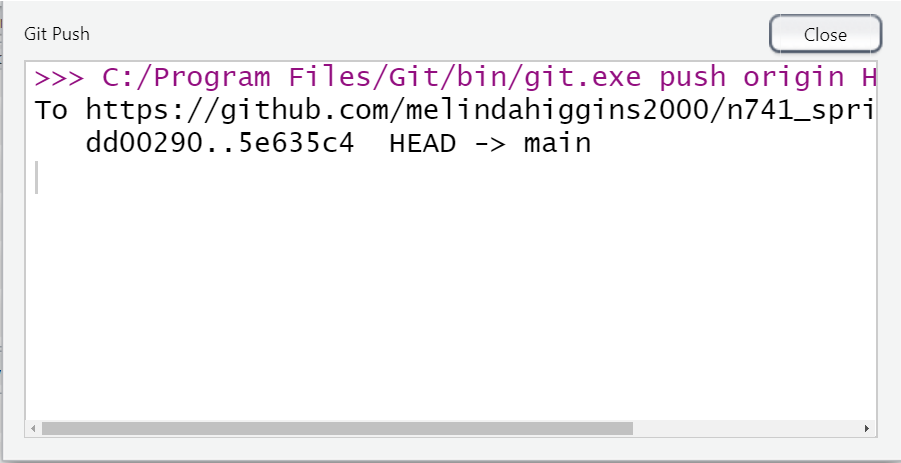
```

**CONGRATULATIONS!! You are now connected and authenticated to sych up your RStudio project to a repository in Github using Git version control and tracking!!**